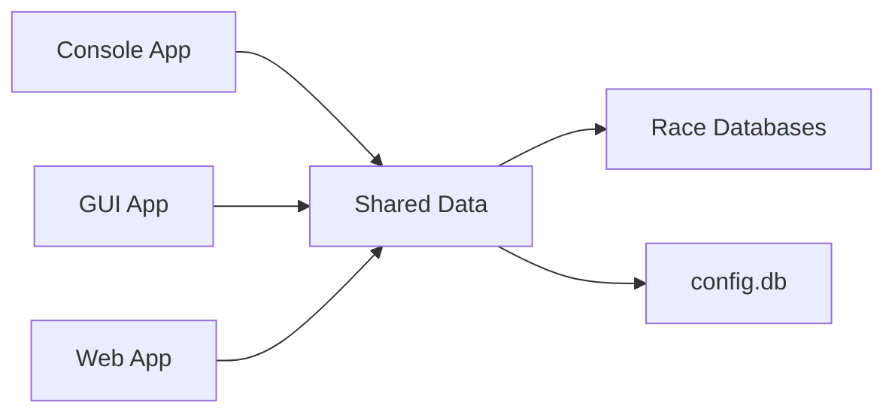

# 🏁 TRTS: The Race Timing Solution for Cross Country and Road Races 🏃‍♀️🏃‍♂️

🎉 Welcome to **TRTS** – a comprehensive, **open-source** race timing system designed for **cross country meets** and **road races**!

TRTS provides professional-grade timing capabilities with multiple interfaces, supporting everything from small school meets to large community road races. The system features team scoring for cross country and age group results for road races, with shared data across console, GUI, and web interfaces.

---

## 🎯 System Overview

TRTS is a **multi-component ecosystem** designed for flexibility and reliability:

### 🧠 **Shared Data Backend** (`/data/`)
- **SQLite databases** with race-specific schemas
- **bcrypt authentication** shared across all applications
- **Automatic race type detection** (Cross Country vs Road Race)
- **Smart database naming**: `YYYYMMDD-##-[cc/rr]-[Race_Name].db`

### 🖥️ **Console Application** (`/console/`)
- **Command-line interface** for live race timing
- **Extensively commented code** (5th-grade friendly explanations)
- **Professional results** with team scoring and age groups
- **Audio feedback** and real-time race clock

### 🎨 **GUI Application** (`/gui/`)
- **GTK4-based visual interface** for desktop timing
- **100% console compatibility** - same databases and authentication
- **Real-time timing window** with live race clock
- **Smart button management** based on race state

### 🌐 **Web Application** (`/web/`)
- **Flask-based results portal** for public viewing
- **Race type aware** - automatically adapts interface
- **Admin panel** for post-race corrections
- **Mobile-responsive** design for spectators

---

## 🏆 Race Types & Scoring

### 🏃‍♀️ **Cross Country Races**
- **Team scoring** using top 5 finishers + 2 displacers
- **Lowest score wins** (like golf scoring)
- **Tiebreaker system** using 6th and 7th runners
- **CSV Format**: `bib, name, team, age, grade, rfid`

### 🏃‍♂️ **Road Races**
- **Age group classification** (1-15, 16-20, 21-25, etc.)
- **Age calculated** automatically from date of birth
- **Individual and age group standings**
- **CSV Format**: `bib, name, dob, rfid`

---

## 📦 System Components

### 🗃️ **Data Layer** (`/data/`)
```
data/
├── config.db                    # Shared authentication (bcrypt)
├── YYYYMMDD-##-cc-Name.db      # Cross Country race database
├── YYYYMMDD-##-rr-Name.db      # Road Race database
├── runners_cc.csv              # Cross Country runner import
├── runners_rr.csv              # Road Race runner import
└── beep.mp3                    # Audio feedback (optional)
```

**Database Schemas:**
- **Cross Country**: `bib, name, team, age, grade, rfid`
- **Road Race**: `bib, name, dob, age, rfid`
- **Results**: `id, bib, finish_time, race_date`
- **Race Type**: `type` ('cross_country' or 'road_race')

### 🖥️ **Console Application** (`/console/`)
```
console/
└── race_timing_console.py      # Main console application
```

**Features:**
- ✅ **Create race databases** with race type selection
- ✅ **Import runners** from CSV with format validation
- ✅ **Live race timing** with real-time clock display
- ✅ **Individual results** sorted by finish time
- ✅ **Team results** (Cross Country) with proper scoring
- ✅ **Age group results** (Road Race) with age divisions
- ✅ **Educational comments** throughout code
- ✅ **Audio feedback** on finish recording

### 🎨 **GUI Application** (`/gui/`)
```
gui/
└── race_timing_gui.py          # GTK4 graphical interface
```

**Features:**
- ✅ **Visual race type selection** during database creation
- ✅ **File browser integration** for CSV and database loading
- ✅ **Real-time timing window** with large race clock
- ✅ **Smart button states** - enabled only when appropriate
- ✅ **Dynamic results button** - adapts to race type
- ✅ **Professional styling** with dual-font system
- ✅ **Cross-platform compatibility** with console databases

### 🌐 **Web Application** (`/web/`)
```
web/
├── app.py                      # Flask application
├── requirements.txt            # Python dependencies
├── templates/                  # HTML templates
│   ├── html_layout.html        # Base template
│   ├── index.html             # Race dashboard
│   ├── individual_results.html # Individual race results
│   ├── team_results.html      # Cross Country team scoring
│   ├── age_group_results.html # Road Race age groups
│   ├── cross_country_results.html # CC race listing
│   ├── road_race_results.html # RR race listing
│   ├── admin.html             # Admin control panel
│   ├── login.html             # Authentication
│   ├── edit_results.html      # Result editing
│   ├── edit_race.html         # Race editing
│   ├── about_us.html          # Static pages
│   ├── contact_us.html
│   ├── help.html
│   ├── documentation.html
│   ├── usage_notes.html
│   └── footer.html
└── static/                     # Static files
    ├── favicon.png
    └── (CSS, JS, images)
```

**Features:**
- ✅ **Race type organization** with separate CC and RR sections
- ✅ **Automatic database detection** and race type identification
- ✅ **Professional results display** ready for printing
- ✅ **Admin authentication** using shared bcrypt system
- ✅ **Result editing capabilities** for post-race corrections
- ✅ **Mobile-responsive design** for all device types
- ✅ **Real-time updates** as races are completed

---

## 🛠️ Installation & Setup

### **System Requirements**
- **Python 3.7+**
- **Operating System**: Linux (primary), macOS, Windows
- **For GUI**: GTK4 with Python bindings
- **For Web**: Flask framework

### **Installation Steps**

#### 1. **Clone/Download Project**
```bash
git clone [repository-url]
cd race-timing-solution
```

#### 2. **Install Dependencies**
```bash
# Console application
pip install bcrypt playsound

# GUI application (Linux/Ubuntu)
sudo apt install python3-gi python3-gi-cairo gir1.2-gtk-4.0
pip install bcrypt

# Web application
cd web
pip install -r requirements.txt
```

#### 3. **First Run Setup**
```bash
# Create admin credentials (any application)
python3 console/race_timing_console.py
# OR
python3 gui/race_timing_gui.py

# Follow prompts to create admin username/password
```

### **Directory Structure Creation**
The applications automatically create the required directory structure:
```
project/
├── console/                    # Console application
├── gui/                       # GUI application
├── web/                       # Web application
└── data/                      # Auto-created shared data
    ├── config.db              # Admin authentication
    └── (race databases)       # Created during use
```

---

## 🎮 Usage Workflows

### 🏃‍♀️ **Cross Country Race Workflow**

#### **Setup Phase**
1. **Choose application** (Console, GUI, or create via either)
2. **Create new database** → Select "Cross Country"
3. **Enter race details** (number, name/location)
4. **Import runners** from CSV with format: `bib,name,team,age,grade,rfid`

#### **Race Day**
1. **Start race timing** (Console or GUI)
2. **Enter bib numbers** as runners finish
3. **Monitor real-time** race clock and results
4. **Stop timing** when race complete

#### **Results** (Any Application)
- **Individual Results**: Overall finish order with times
- **Team Results**: Top 5 scoring + displacers, team rankings
- **Web Portal**: Instant online access for coaches/spectators

### 🏃‍♂️ **Road Race Workflow**

#### **Setup Phase**
1. **Choose application** (Console, GUI, or create via either)
2. **Create new database** → Select "Road Race"
3. **Enter race details** (number, name/location)
4. **Import runners** from CSV with format: `bib,name,dob,rfid`

#### **Race Day**
1. **Start race timing** (Console or GUI)
2. **Enter bib numbers** as runners finish
3. **Monitor real-time** race clock and results
4. **Stop timing** when race complete

#### **Results** (Any Application)
- **Individual Results**: Overall finish order with times
- **Age Group Results**: Standings by age division (1-15, 16-20, etc.)
- **Web Portal**: Instant online access for participants/families

---

## 🔄 Cross-Application Integration

### **Shared Authentication**
- **Single admin account** works across all applications
- **bcrypt password hashing** for security
- **Automatic config detection** by all applications

### **Database Compatibility**


- **100% compatibility** between all applications
- **Real-time data sharing** via SQLite databases
- **Race type preservation** across applications
- **Identical result calculations** in all interfaces

### **Typical Multi-Application Setup**
1. **Console/GUI**: Race creation and live timing
2. **Web Application**: Public results viewing and admin corrections
3. **Data Layer**: Seamless synchronization between all components

---

## 📊 Sample Data Formats

### **Cross Country CSV**
```csv
bib,name,team,age,grade,rfid
101,John Smith,Lincoln High,16,11,ABC123
102,Jane Doe,Roosevelt MS,14,8,DEF456
103,Mike Johnson,Central HS,17,12,GHI789
```

### **Road Race CSV**
```csv
bib,name,dob,rfid
201,Sarah Wilson,1985-03-15,JKL012
202,Tom Brown,1992-07-22,MNO345
203,Lisa Davis,1978-11-08,PQR678
```

### **Database Naming Examples**
```
20250727-01-cc-County_Meet.db        # Cross Country
20250727-02-rr-5K_Fun_Run.db         # Road Race  
20250801-01-cc-Regional_Championship.db
20250815-03-rr-Summer_Series.db
```

---

## 🏆 Results Examples

### **Cross Country Team Results**
```
Rank 1 - Team: Lincoln High School
Team Score = 28

Top 5:
  Place 2, Bib 101, John Smith, 16:45.123
  Place 5, Bib 102, Jane Doe, 17:02.456
  Place 7, Bib 103, Mike Johnson, 17:15.789
  Place 6, Bib 104, Sarah Lee, 17:08.234
  Place 8, Bib 105, Tom Wilson, 17:22.567

Displacers:
  Place 12, Bib 106, Lisa Chen, 17:45.890
  Place 15, Bib 107, David Park, 18:02.123
```

### **Road Race Age Group Results**
```
Age Group 16-20
Place  Bib   Name            Time
1      201   Mike Johnson    18:45.123
2      203   Sarah Davis     19:12.456
3      205   Tom Wilson      19:34.789

Age Group 21-25
Place  Bib   Name            Time
1      207   Lisa Brown      17:23.456
2      209   John Smith      18:01.234
```

---

## 🎨 User Interface Highlights

### **Console Application**
- **Menu-driven interface** with numbered options
- **Real-time race clock** during timing
- **Educational comments** throughout code
- **Professional result formatting**

### **GUI Application**
- **Modern GTK4 interface** with professional styling
- **Visual race type selection** dialogs
- **Smart button management** (enabled/disabled based on state)
- **Large timing window** with real-time clock

### **Web Application**
- **Bootstrap-responsive design** for all devices
- **Race type color coding** (Blue for CC, Green for RR)
- **Print-optimized** result layouts
- **Admin panel** for post-race management

---

## 🔧 Technical Architecture

### **Data Flow**
```
CSV Import → Database Creation → Race Timing → Results Display
     ↓              ↓                ↓              ↓
  Validation   Type Detection   Real-time Clock   Multi-format
```

### **Authentication Flow**
```
First Run → Admin Setup → bcrypt Hash → Shared config.db
                                            ↓
Console ←── Shared Authentication ──→ GUI ←──→ Web App
```

### **Race Type Detection**
1. **Database creation** stores race type in `race_type` table
2. **All applications** check this table on database load
3. **Interface adaptation** based on detected type
4. **Result calculations** use appropriate logic (team vs age group)

---

## 🚨 Troubleshooting

### **Common Issues**

#### **Database Problems**
```
Issue: "Race type not detected"
Solution: Ensure database created with Console/GUI v1.0+
         Legacy databases may need manual type assignment
```

#### **CSV Import Errors**
```
Issue: "Invalid CSV format"
Solution: Cross Country needs: bib,name,team,age,grade,rfid
         Road Race needs: bib,name,dob,rfid
         Check column headers match exactly
```

#### **Authentication Issues**
```
Issue: "Login failed"
Solution: Create admin user with Console or GUI first
         All applications share same config.db
```

#### **GUI Display Problems**
```
Issue: "GUI won't start"
Solution: Install GTK4: sudo apt install python3-gi gir1.2-gtk-4.0
         Check Python version (3.7+ required)
```

### **Debug Procedures**
```bash
# Console application
python3 console/race_timing_console.py

# GUI application (with debug)
python3 gui/race_timing_gui.py 2>&1 | tee debug.log

# Web application (debug mode)
cd web
FLASK_DEBUG=True python3 app.py
```

---

## 🎓 Educational Value

### **Programming Concepts Demonstrated**
- **Database design** with SQLite and relational data
- **User interface development** (CLI, GUI, Web)
- **Authentication systems** with secure password hashing
- **File I/O** and CSV processing
- **Real-time applications** with timing systems
- **Cross-platform compatibility**

### **Race Management Concepts**
- **Cross country team scoring** rules and calculations
- **Age group classification** systems
- **Race timing** procedures and best practices
- **Results presentation** and distribution

### **Learning Resources**
- **Extensive code comments** in console version (5th-grade level)
- **Clear architecture** demonstrating software design patterns
- **Real-world application** solving actual problems
- **Open source** for educational use and modification

---

## 🏢 Professional Use

### **Deployment Scenarios**
- **School Districts**: Cross country meet management
- **Running Clubs**: Road race events and series
- **Event Companies**: Professional race timing services
- **Community Events**: Local 5Ks and fun runs

### **Scalability**
- **Small races**: 50-100 participants
- **Medium races**: 100-500 participants  
- **Large races**: 500+ participants (with proper hardware)

### **Hardware Recommendations**
- **Development**: Any modern laptop/desktop
- **Race Day Console**: Raspberry Pi 4 or laptop
- **Race Day GUI**: Laptop with GTK4 support
- **Web Hosting**: Any VPS or cloud provider

---

## 📬 Support & Contact

### **Developer**
👨‍💻 **TJ Tryon**  
📧 **Email**: [tj@tjtryon.com](mailto:tj@tjtryon.com)  
📱 **Phone**: 317-774-8762  
🏢 **Company**: Midwest Event Services, Inc.

### **Project Information**
- **License**: MIT License - Free for all use
- **Repository**: Open source development
- **Documentation**: Comprehensive README files for each component
- **Support**: Community-driven with developer assistance

### **Getting Help**
1. **Check troubleshooting** sections in component READMEs
2. **Review educational comments** in console application
3. **Contact developer** for professional support or custom development

---

## 🔮 Future Development

### **Planned Features**
- **RFID Integration**: Hardware timer integration
- **Mobile Apps**: Native iOS/Android applications
- **Cloud Deployment**: Hosted service options
- **Advanced Analytics**: Performance tracking and trends
- **Multi-Event Support**: Championship series management

### **Contributing**
- **Open source** development model
- **Educational focus** for learning programming
- **Professional quality** for real-world use
- **Community contributions** welcome

---

## 📜 License

**MIT License © 2025**

Permission is hereby granted, free of charge, to any person obtaining a copy of this software and associated documentation files (the "Software"), to deal in the Software without restriction, including without limitation the rights to use, copy, modify, merge, publish, distribute, sublicense, and/or sell copies of the Software.

**You can use it, change it, and share it — just keep it open!** 💡🛠️

---

## 🎯 Quick Start Summary

### **For Race Directors**
1. **Install** Python and dependencies
2. **Choose interface** (Console for simplicity, GUI for visual, Web for spectators)
3. **Create race database** with appropriate type
4. **Import runners** from CSV
5. **Time race** and **view results**

### **For Developers**
1. **Study console version** for extensively commented learning code
2. **Examine GUI** for modern desktop application patterns  
3. **Review web app** for Flask development techniques
4. **Contribute** improvements or adaptations

### **For Schools/Organizations**
1. **Download and install** on existing hardware
2. **Train volunteers** on chosen interface
3. **Create standard procedures** for race day
4. **Customize** as needed for specific requirements

---

**Made with ❤️ for the running community.**

🏃‍♀️🏃‍♂️ *TRTS: Professional race timing, accessible to everyone.* ⏱️🌟